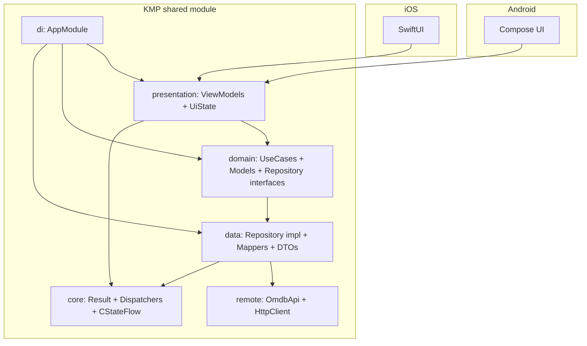

# Learning Path — findMovies (KMP)

This document is a tutorial-style guide to help you study the project, the errors that appeared, and why each class exists.

---

## 1) Errors I hit and what they mean

1) **`KotlinSourceSet 'iosMain' not found`**
   - **Where:** `shared/build.gradle.kts`
   - **Why:** KMP doesn’t create `iosMain` automatically when you define targets manually.  
   - **Fix:** Create `iosMain` explicitly and make `iosX64Main`, `iosArm64Main`, `iosSimulatorArm64Main` depend on it.

2) **Kotlin null safety crash**  
   - **Where:** `androidApp/.../DetailScreen.kt`  
   - **Error:** `Only safe (?.) or non-null asserted (!!.) calls are allowed...`  
   - **Why:** `state.movie` is nullable.  
   - **Fix:** Use `state.movie?.let { ... }`.

3) **Swift optional unwrap errors**  
   - **Where:** `iosApp/DetailView.swift`  
   - **Error:** `Value of optional type 'DetailUiState?' must be unwrapped`  
   - **Why:** Kotlin `StateFlow` values map to optionals in Swift.  
   - **Fix:** Use a fallback (`defaultDetailUiState()`) when the value is nil.

4) **`init()` unavailable for Kotlin data classes in Swift**  
   - **Where:** `DetailView.swift`  
   - **Why:** Kotlin data classes with default values don’t always generate a Swift `init()` with no args.  
   - **Fix:** Expose `defaultDetailUiState()` and `defaultSearchUiState()` in Kotlin, call them from Swift.

5) **`dispatcherProvider` missing in Swift**  
   - **Where:** `ContentView.swift`  
   - **Why:** Swift doesn’t see default arguments from Kotlin for constructors.  
   - **Fix:** Add a secondary Kotlin constructor: `constructor(apiKey: String)`.

6) **Android crash on search: `missing INTERNET permission`**  
   - **Where:** `AndroidManifest.xml`  
   - **Why:** OkHttp needs network permission.  
   - **Fix:** Add `<uses-permission android:name="android.permission.INTERNET" />`.

7) **iOS List errors: `size` / `get` not found**  
   - **Where:** `SearchView.swift`  
   - **Why:** Swift sees `[Movie]`, not Kotlin `List`.  
   - **Fix:** Use `.count` and `[index]` directly.

8) **Git 403 push error**  
   - **Why:** Account had no permission or wrong credentials.  
   - **Fix:** Add correct org permissions and configure SSH key.

---

## 2) Architecture used

**Clean Architecture + MVVM**, with shared business logic in KMP:

- **core**: reusable helpers and platform bridges  
- **data**: API clients, DTOs, mappers, repositories  
- **domain**: models + use cases + repository contracts  
- **presentation**: UI state + ViewModels  
- **di**: AppModule as manual dependency container

This keeps **UI thin**, **logic centralized**, and is good for interviews.

### Architecture diagram (Mermaid)

---

## 3) Shared module classes (Kotlin)

### core

- **`AppResult`**  
  **Syntax:** `sealed class`  
  **Why:** Represent success/failure in a typed way.  
  **Usage:** `Success(data)` or `Error(message)`.

- **`DispatcherProvider` / `DefaultDispatcherProvider`**  
  **Syntax:** `interface` + implementation  
  **Why:** abstract coroutines dispatchers to ease testing.

- **`CStateFlow` + `asCStateFlow()`**  
  **Syntax:** wrapper class + extension function  
  **Why:** Bridge Kotlin `StateFlow` to Swift with `watch {}` callback.

### data

- **`OmdbDtos.kt`**  
  **Syntax:** `@Serializable` data classes  
  **Why:** Map JSON responses from OMDb.

- **`HttpClientFactory` (expect/actual)**  
  **Syntax:** `expect fun` in common, `actual fun` in platform  
  **Why:** Platform-specific Ktor engines (OkHttp for Android, Darwin for iOS).

- **`OmdbApi`**  
  **Syntax:** class using Ktor `HttpClient`  
  **Why:** Network calls for search + detail.

- **`MovieMapper`**  
  **Syntax:** extension functions  
  **Why:** Convert DTO → Domain models.

- **`MovieRepositoryImpl`**  
  **Syntax:** class implementing interface  
  **Why:** Orchestrate API calls and return `AppResult`.

### domain

- **`Movie` / `MovieDetail`**  
  **Syntax:** `data class`  
  **Why:** Clean domain models used by UI.

- **`MovieRepository`**  
  **Syntax:** interface  
  **Why:** Contract for data layer. Allows testing/mocking.

- **`SearchMoviesUseCase` / `GetMovieDetailUseCase`**  
  **Syntax:** class with `operator fun invoke`  
  **Why:** Encapsulate business use cases.

### presentation

- **`BaseViewModel`**  
  **Syntax:** open class  
  **Why:** Centralize coroutine scope + lifecycle cleanup.

- **`SearchUiState` / `DetailUiState`**  
  **Syntax:** data class  
  **Why:** Single source of truth for UI state.  
  **Note:** `defaultSearchUiState()` / `defaultDetailUiState()` added for Swift.

- **`SearchViewModel` / `DetailViewModel`**  
  **Syntax:** class extending `BaseViewModel`  
  **Why:** MVVM state holder. Executes use cases, updates state.

### di

- **`AppModule`**  
  **Syntax:** class (manual DI)  
  **Why:** Centralizes construction of API, repository, use cases, viewmodels.  
  **Extra:** Secondary constructor for Swift convenience.

### legacy template files

- **`Platform.kt` + `Platform.android.kt` + `Platform.ios.kt`**  
  **Why:** KMP template files, not used by the app logic.

- **`Greeting.kt`**  
  **Why:** Template file, not used.

---

## 4) Android classes (Compose)

- **`MainActivity`**  
  **Why:** Entry point. Creates `AppModule` and sets Compose content.

- **`AppRoot`**  
  **Why:** Simple navigation between Search and Detail without a nav library.

- **`SearchScreen`**  
  **Why:** UI for search. Collects `state`, shows list + thumbnails.

- **`DetailScreen`**  
  **Why:** UI for movie details. Shows large poster + metadata.

- **`PosterUrl.kt`**  
  **Why:** Builds OMDb poster URL using local API key.

---

## 5) iOS classes (SwiftUI)

- **`ContentView`**  
  **Why:** Entry view. Creates module and routes to Search/Detail.

- **`SearchViewModelWrapper` / `DetailViewModelWrapper`**  
  **Syntax:** `ObservableObject`  
  **Why:** Bridge Kotlin ViewModel to SwiftUI with `@Published state`.

- **`SearchView` / `DetailView`**  
  **Why:** SwiftUI screens using shared state + AsyncImage.

- **`AppConfig`**  
  **Why:** Reads API keys from environment or Info.plist.

- **`PosterUrl.swift`**  
  **Why:** Build poster URLs for thumbnails and detail images.

---

## 6) Useful syntax summary (Kotlin & Swift)

### Kotlin
- `sealed class` → restricted class hierarchy (useful for Result types)
- `data class` → auto `equals/hashCode/toString`
- `expect/actual` → platform-specific implementation
- `StateFlow` → observable state stream
- `operator fun invoke` → allows `useCase(query)` syntax

### Swift
- `@StateObject` → owns observable object lifecycle
- `@ObservedObject` → observes external object
- `@Published` → emits SwiftUI updates
- `AsyncImage` → loads remote images easily

---

## 7) Where to study next

1) Start at **`SearchViewModel`** and follow the flow:
   - View → ViewModel → UseCase → Repository → API → DTO → Mapper → Domain
2) Check **`AppModule`** to see how everything is wired.
3) Compare **Search vs Detail** to understand MVVM consistency.

---

## 8) Detailed complexity table (per method)

| Method / Operation | File | Time | Space | Reasoning |
|---|---|---|---|---|
| `SearchViewModel.search()` | `shared/.../SearchViewModel.kt` | O(1) local | O(1) | Delegates to use case; no loops. |
| `MovieRepositoryImpl.searchMovies()` | `shared/.../MovieRepositoryImpl.kt` | O(n) | O(n) | `map` over `response.search` creates a new list. |
| `OmdbMovieDto.toDomain()` | `shared/.../MovieMapper.kt` | O(1) | O(1) | Field-to-field mapping. |
| `DetailViewModel.load()` | `shared/.../DetailViewModel.kt` | O(1) local | O(1) | Delegates to use case; no loops. |
| `OmdbDetailResponse.toDomain()` | `shared/.../MovieMapper.kt` | O(1) | O(1) | Field-to-field mapping. |
| `LazyColumn(items)` | `androidApp/.../SearchScreen.kt` | O(n) | O(n) | Renders each item in the list. |
| `ForEach(0..<movieCount)` | `iosApp/.../SearchView.swift` | O(n) | O(n) | Renders each item in the list. |
| `posterUrl(...)` | `androidApp/.../PosterUrl.kt` | O(1) | O(1) | String concatenation. |
| `posterUrl(...)` | `iosApp/.../PosterUrl.swift` | O(1) | O(1) | String concatenation. |

---

## 9) Mocked tests added

These tests validate behavior using fake data (no network):

- `SearchMoviesUseCaseTest` — fake repository returns a list.
- `GetMovieDetailUseCaseTest` — fake repository returns one detail.
- `MovieMapperTest` — DTO mapping rules (poster "N/A" → null).

---

If you want, I can add diagrams or expand this into a step-by-step “build it from scratch” guide.
